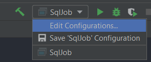
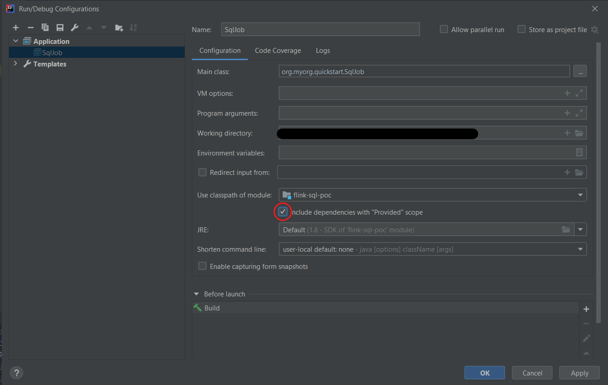

# Flink SQL POC

## Steps to run the Flink Job in IntelliJ




## Tests
The following commands work for Windows and Linux, but in Windows they must be executed in Git Bash (or similar), using "unix paths ('/')".

`tr -d '\r\n'` works for both, CRLF ('\r\n', Windows) and LF ('\n', Linux and MacOS).

The commands must be executed from the project root folder.

### Initial configuration
Set Kafka absolute path:
```bash
export KAFKA_ABSOLUTE_PATH="<kafka-absolute-path>"

# Example for Windows:
export KAFKA_ABSOLUTE_PATH="/c/Kafka/kafka_2.13-2.6.0"
```

For Windows:
```bash
export KAFKA_CONSOLE_PRODUCER="$KAFKA_ABSOLUTE_PATH/bin/windows/kafka-console-producer.bat"
export KAFKA_CONSOLE_CONSUMER="$KAFKA_ABSOLUTE_PATH/bin/windows/kafka-console-consumer.bat"
export KAFKA_TOPICS="$KAFKA_ABSOLUTE_PATH/bin/windows/kafka-topics.bat"
```

For Linux:
```bash
export KAFKA_CONSOLE_PRODUCER="$KAFKA_ABSOLUTE_PATH/bin/kafka-console-producer.sh"
export KAFKA_CONSOLE_CONSUMER="$KAFKA_ABSOLUTE_PATH/bin/kafka-console-consumer.sh"
export KAFKA_TOPICS="$KAFKA_ABSOLUTE_PATH/bin/kafka-topics.sh"
```

### Create Kafka topics
```bash
"$KAFKA_TOPICS" --create --zookeeper localhost:2181 --replication-factor 1 --partitions 1 --topic movies
"$KAFKA_TOPICS" --create --zookeeper localhost:2181 --replication-factor 1 --partitions 1 --topic directors
```

### Test 1 (update normal fields)
Here we test inserts and updates in normal fields (fields that are not used as FKs and are not used in the filters of the WHERE clause).

| Event num | Input event                    | Output events                       |
|-----------|--------------------------------|-------------------------------------|
| 1         | movie1-event1                  |                                     |
| 2         | director1-event1               | director1-movie1                    |
| 3         | movie2-event1                  | director1-movie2                    |
| 4         | director2-event1               |                                     |
| 5         | movie3-event1                  | director2-movie3                    |
| 6         | director1-event2 (update name) | director1-movie1 ; director1-movie2 |
| 7         | director2-event2 (update name) | director2-movie3                    |
| 8         | director1-event3 (update name) | director1-movie1 ; director1-movie2 |
| 9         | movie1-event2 (update name)    | director1-movie1                    |

```bash
cat docs/events/movies/movie1/movie1-event1.json | tr -d '\r\n' | "$KAFKA_CONSOLE_PRODUCER" --topic movies --broker-list localhost:9092
cat docs/events/directors/director1/director1-event1.json | tr -d '\r\n' | "$KAFKA_CONSOLE_PRODUCER" --topic directors --broker-list localhost:9092
cat docs/events/movies/movie2/movie2-event1.json | tr -d '\r\n' | "$KAFKA_CONSOLE_PRODUCER" --topic movies --broker-list localhost:9092
cat docs/events/directors/director2/director2-event1.json | tr -d '\r\n' | "$KAFKA_CONSOLE_PRODUCER" --topic directors --broker-list localhost:9092
cat docs/events/movies/movie3/movie3-event1.json | tr -d '\r\n' | "$KAFKA_CONSOLE_PRODUCER" --topic movies --broker-list localhost:9092
cat docs/events/directors/director1/director1-event2-update-name.json | tr -d '\r\n' | "$KAFKA_CONSOLE_PRODUCER" --topic directors --broker-list localhost:9092
cat docs/events/directors/director2/director2-event2-update-name.json | tr -d '\r\n' | "$KAFKA_CONSOLE_PRODUCER" --topic directors --broker-list localhost:9092
cat docs/events/directors/director1/director1-event3-update-name.json | tr -d '\r\n' | "$KAFKA_CONSOLE_PRODUCER" --topic directors --broker-list localhost:9092
cat docs/events/movies/movie1/movie1-event2-update-name.json | tr -d '\r\n' | "$KAFKA_CONSOLE_PRODUCER" --topic movies --broker-list localhost:9092
```

### Test 2 (update field to don't pass the filters in the WHERE clause)
Here we test that an event that previously passed the filters in the WHERE clause, now doesn't pass those filters, due to a change in the fields of that event.  
As a consequence of that, Flink should generate an event that retracts that event, to remove it from the "final materialized view", because it no longer satisfies the SQL query.

| Event num | Input event                            | Output events            |
|-----------|----------------------------------------|--------------------------|
| 10        | movie3-event2 (nominatedToOscar=false) | retract director2-movie3 |
| 11        | director2-event3 (update name)         |                          |

```bash
cat docs/events/movies/movie3/movie3-event2-update-nominated-to-oscar-to-false.json | tr -d '\r\n' | "$KAFKA_CONSOLE_PRODUCER" --topic movies --broker-list localhost:9092
cat docs/events/directors/director2/director2-event3-update-name.json | tr -d '\r\n' | "$KAFKA_CONSOLE_PRODUCER" --topic directors --broker-list localhost:9092
```

### Test 3 (update FK field)
Here we test that a change in the FK value of an event is reflected in the joins.  
Flink should remove from the join states the relationship between that event and it's previous FK, and also generate an event that retracts that relationship, to remove it from the "final materialized view", because it is no longer valid.

| Event num | Input event                      | Output events                               |
|-----------|----------------------------------|---------------------------------------------|
| 12        | movie2-event2 (FK change D1->D2) | retract director1-movie2 ; director2-movie2 |
| 13        | director2-event4 (update name)   | director2-movie2                            |
| 14        | director1-event4 (update name)   | director1-movie1                            |

```bash
cat docs/events/movies/movie2/movie2-event2-fk-change.json | tr -d '\r\n' | "$KAFKA_CONSOLE_PRODUCER" --topic movies --broker-list localhost:9092
cat docs/events/directors/director2/director2-event4-update-name.json | tr -d '\r\n' | "$KAFKA_CONSOLE_PRODUCER" --topic directors --broker-list localhost:9092
cat docs/events/directors/director1/director1-event4-update-name.json | tr -d '\r\n' | "$KAFKA_CONSOLE_PRODUCER" --topic directors --broker-list localhost:9092
```
