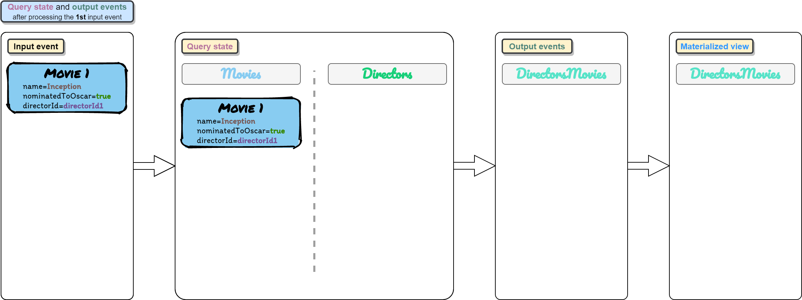
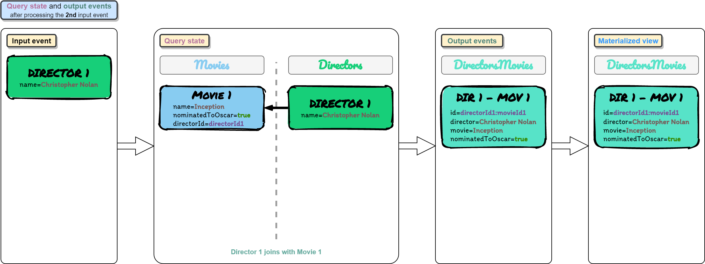
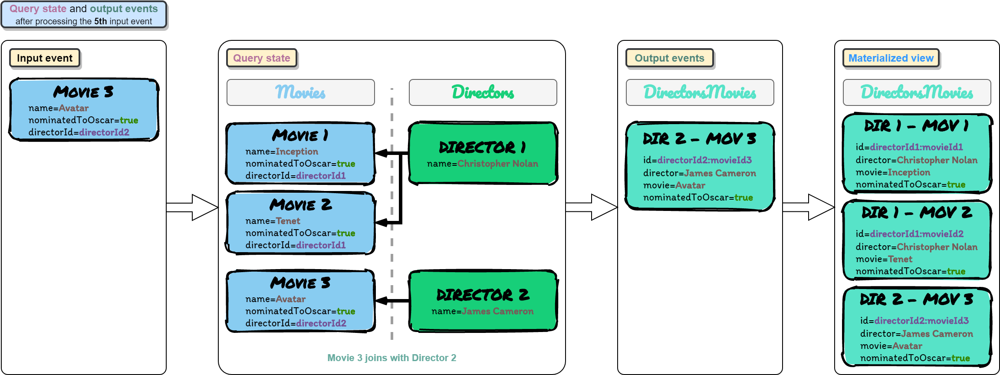
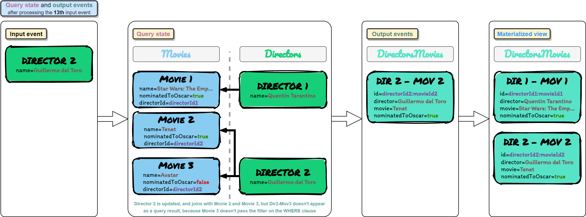

# Flink SQL POC

This project represents a Proof of Concept of Flink SQL capabilities.

It uses Vagrant to automate the creation of an Ubuntu VM that installs Docker,
pulls Zookeeper, Kafka and Kafkacat Docker images from DockerHub,
and runs containers for all of them with the corresponding port mappings for Kafka.


## Flink SQL concepts
The Table API and SQL interfaces integrate seamlessly with each other
and [Flink’s DataStream API](https://ci.apache.org/projects/flink/flink-docs-release-1.12/dev/table/common.html#integration-with-datastream-and-dataset-api).

Tables describe external data, such as a file, database table, or message queue.  
Tables may either be temporary, and tied to the lifecycle of a single Flink session,
or permanent, and visible across multiple Flink sessions and clusters.  
In this PoC we will only be using temporary tables.

Flink’s SQL integration is based on Apache Calcite, which implements the SQL standard.
SQL queries are specified as regular Strings.

Flink SQL queries are translated into DataStream programs whether their input is streaming or batch.

A SQL query is translated to a DataStream when:
* `TableEnvironment.executeSql()` is called
* `Table.executeInsert()` is called
* When a Table is converted into a DataStream
* Other situations (explained in the [documentation](https://ci.apache.org/projects/flink/flink-docs-release-1.12/dev/table/common.html#translate-and-execute-a-query))

A Table is emitted to an external system by writing it to a TableSink.
A TableSink is a generic interface to support a wide variety of file formats (e.g. CSV, Apache Parquet, Apache Avro),
storage systems (e.g., JDBC, Apache HBase, Apache Cassandra, Elasticsearch), or messaging systems (e.g., Apache Kafka, RabbitMQ).

A continuous query never terminates and produces dynamic results (another dynamic table).
The query continuously updates its (dynamic) result table to reflect changes on its (dynamic) input tables.

The following figure visualizes the relationship of [streams, dynamic tables, and continuous queries](https://ci.apache.org/projects/flink/flink-docs-release-1.12/dev/table/streaming/dynamic_tables.html#dynamic-tables--continuous-queries):  


1. A stream is converted into a dynamic table.
2. A continuous query is evaluated on the dynamic table yielding a new dynamic table.
3. The resulting dynamic table is converted back into a stream.

> Dynamic tables are foremost a logical concept. Dynamic tables are not necessarily (fully) materialized during query execution.

A dynamic table can be continuously modified by INSERT, UPDATE, and DELETE changes just like a regular database table.  
When converting a dynamic table into a stream or writing it to an external system, these changes need to be encoded.  
Flink’s Table API and SQL support three ways to encode the changes of a dynamic table:
* __Append-only stream__: A dynamic table that is only modified by INSERT changes can be converted into a stream by emitting the inserted rows.
* __Retract stream__: Stream with two types of messages, add messages and retract messages.
  A dynamic table is converted into a retract stream by encoding:
  * An INSERT change as add message
  * A DELETE change as a retract message
  * An UPDATE change as a retract message for the updated (previous) row and an additional message for the updating (new) row

  
* __Upsert stream__: Stream with two types of messages, upsert messages and delete messages.
   A dynamic table that is converted into an upsert stream requires a (possibly composite) unique key.
   A dynamic table with a unique key is transformed into a stream by encoding:
   * INSERT and UPDATE changes as upsert messages
   * DELETE changes as delete messages

   __The main difference to a retract stream__ is that __UPDATE changes are encoded with a single message__ and hence __more efficient__.

  
  
> __IMPORTANT:__ Only append and retract streams are supported when converting a dynamic table into a DataStream.
> Upsert streams are NOT currently supported.


## Kafka
Kafka will be accessible:
* To the Docker containers inside the VM through `kafka:29092`
* To the VM and the host machine through `localhost:9092`
    * This is due to port mappings in the Kafka container and in the Vagrant VM

The following diagram shows the architecture:


### Kafka listeners
Rules:
* No listeners may share a port number.
* An advertised.listener must be present by protocol name and port number in the list of listeners.
* The script that configures the Docker image uses the listener name to determine whether to include the SSL configuration items. 
  If you want to use SSL, you need to include SSL in your listener name (e.g. OUTSIDE_SSL).
* Kafka brokers communicate between themselves, usually on the internal network (e.g. Docker network, AWS VPC, etc).
  To define which listener to use, specify KAFKA_INTER_BROKER_LISTENER_NAME (inter.broker.listener.name).
  The host/IP used must be accessible from the broker machine to others.

Kafka clients may well not be local to the broker’s network, and this is where the additional listeners come in.

When you run a client, the broker you pass to it is just where it’s going to go and get the metadata about brokers in the cluster from.
The actual host & IP that it will connect to for reading/writing data is based on the data that the broker passes back in that initial connection.

When connecting to a broker, the listener that will be returned to the client will be the listener to which you connected (based on the port).

With all this information, the following environment variables in the Kafka Docker image should be used to configure the listeners:
```yaml
kafka:
  environment:
    KAFKA_LISTENERS: INSIDE://kafka:29092,OUTSIDE://:9092
    KAFKA_ADVERTISED_LISTENERS: INSIDE://kafka:29092,OUTSIDE://localhost:9092
    KAFKA_LISTENER_SECURITY_PROTOCOL_MAP: INSIDE:PLAINTEXT,OUTSIDE:PLAINTEXT
    KAFKA_INTER_BROKER_LISTENER_NAME: INSIDE
```

The listener endpoint returned by Kafka can be tested with the following commands, executed inside the VM:
```bash
docker run --network=vagrant_default -it --rm edenhill/kafkacat:1.6.0 -b kafka:29092 -L

sudo apt-get install -y kafkacat
kafkacat -b localhost:9092 -L
```

> kafkacat is a useful tool for exploring this. Using -L you can see the metadata for the listener to which you connected. 

[More info about how Kafka listeners work](https://rmoff.net/2018/08/02/kafka-listeners-explained/)

### Kafka topics
The Flink `kafka-upsert` connector used in this PoC:
* [Requires input topics to be compacted](https://cwiki.apache.org/confluence/display/FLINK/FLIP-149%3A+Introduce+the+upsert-kafka+Connector#FLIP149:IntroducetheupsertkafkaConnector-Upsert-kafkaSource)
* Requires input topics to set as Kafka event key the PK of that row in the origin database
* Requires input topics to set delete events as events with null value (`tombstone`)
* [Always reads input topics from the earliest offset](https://cwiki.apache.org/confluence/display/FLINK/FLIP-149%3A+Introduce+the+upsert-kafka+Connector#FLIP149:IntroducetheupsertkafkaConnector-Upsert-kafkaSource)
* [Produces a changelog stream, where each data record represents an update or delete event](https://cwiki.apache.org/confluence/display/FLINK/FLIP-149%3A+Introduce+the+upsert-kafka+Connector#FLIP149:IntroducetheupsertkafkaConnector-Upsert-kafkaConnectorDefinition)
    * A data record in a changelog stream is interpreted as an UPSERT aka INSERT/UPDATE because any existing row with the same key is overwritten
    * Null values are interpreted in a special way: a record with a null value represents a “DELETE”

The `docker-compose.yml` file automatically creates the following topics in the Kafka executed in the Docker container:
* __movies__:           1 partitions, 1 replicas, compacted
* __directors__:        1 partitions, 1 replicas, compacted
* __directors-movies__: 1 partitions, 1 replicas, compacted

This is specified in the `docker-compose.yml` file, in the following line:
```yaml
KAFKA_CREATE_TOPICS: "movies:1:1:compact,directors:1:1:compact,directors-movies:1:1:compact"
```

#### Compaction
To tune the Kafka compaction mechanism, the following properties have to be set at __broker level__:
* [log.segment.bytes](https://kafka.apache.org/documentation.html#brokerconfigs_log.segment.bytes)
    * The maximum size of a single log file
* [log.cleaner.min.cleanable.ratio](https://kafka.apache.org/documentation.html#brokerconfigs_log.cleaner.min.cleanable.ratio)
    * The minimum ratio of dirty log to total log for a log to be eligible for cleaning
    * This ratio bounds the maximum space wasted in the log by duplicates
    * A higher ratio will mean fewer, more efficient cleanings but will mean more wasted space in the log
* [log.cleaner.delete.retention.ms](https://kafka.apache.org/documentation.html#brokerconfigs_log.cleaner.delete.retention.ms)
    * How long are delete records (`tombstone`) retained?
    * This is a crucial config, because if tombstones represent delete events, we may need to keep them in the log,
      so applications can handle them at any time by reprocessing the entire log,
      e.g., if Flink needs to delete those events from the Flink state.
    * However, it doesn't make sense to keep those delete events forever, because new applications consuming the log
      do not need to read those delete events.
    * For all those reasons, the best solution is to specify a value for this property that is high enough to
      allow Flink applications to be executed from a savepoint that was created a couple of days ago, 
      and that those applications can read those delete events because they have not expired yet.
        * TL;DR: For production, `1 week` should be more than enough
* [log.cleaner.threads](https://kafka.apache.org/documentation.html#brokerconfigs_log.cleaner.threads)
    * The number of background threads to use for log cleaning
    * By default, is 1. In production, it may need to be tuned.
* Other properties whose name starts with `log.cleaner.`

Some of these properties are specified in the `docker-compose.yml` file, as environment variables, in the following lines:
```yaml
kafka:
  environment:
    # Segment size of 1MB (event size is around 200B)
    # This allows compaction to take effect in non-active segments in this PoC
    KAFKA_LOG_SEGMENT_BYTES: 1024
    # The minimum ratio of dirty log to total log for a log to be eligible for cleaning
    # A higher ratio will mean fewer, more efficient cleanings but will mean more wasted space in the log
    # A log is elegible for cleaning if there is, at least, a 10% of duplicates
    KAFKA_LOG_CLEANER_MIN_CLEANABLE_RATIO: 0.1
    # How long are delete records (tombstone) retained
    # 5 minutes allow deletion of tombstones to be seen in this PoC
    KAFKA_LOG_CLEANER_DELETE_RETENTION_MS: 300000
```

When using compaction, you will want to monitor the following Kafka metrics:
* `uncleanable-partitions-count`
* `max-clean-time-secs`
* `max-compaction-delay-secs metrics`

This is explained in more detail in thw following links:
* [Kafka compaction documentation](https://kafka.apache.org/documentation/#compaction)
* [Blog: Log compacted topics in Apache Kafka](https://towardsdatascience.com/log-compacted-topics-in-apache-kafka-b1aa1e4665a7)


## Entity relationship model
The following image shows the entity relationship model used in this demo:


## Configuration file
Some configuration properties to execute the job are present in the `resources/conf.properties` file.

These properties are parsed to the `JobConfig` interface, using the [OWNER library](http://owner.aeonbits.org/),
and then they are used in the `SqlJob` class.


## Prerequisites
* [Install VirtualBox](https://www.virtualbox.org/wiki/Downloads)
* [Install Vagrant](https://www.vagrantup.com/docs/installation)
* Install the `vagrant-docker-compose` Vagrant plugin:
  ```bash
  vagrant plugin install vagrant-docker-compose
  ```


## Steps to execute the POC
This section explains how to execute all the test cases implemented to test the Flink SQL capabilities.

### 1. Start the VM [host]
This will install Docker inside that VM, pull the docker images from DockerHub,
and run containers for Zookeeper and Kafka (Kafkacat will start and stop, it does not matter).

```bash
vagrant up
```

### 2. Connect to the VM [host]
This connection is done via ssh.

```bash
vagrant ssh
```

### 3. Set environment variables [vm]
```bash
export KAFKA_PRODUCER_MOVIES_PREFIX="docker run --network=vagrant_default -v /vagrant:/vagrant -it --rm edenhill/kafkacat:1.6.0 -b kafka:29092 -P -t movies -D '~' -K '|' -Z -l /vagrant/docs/events/movies/"
export KAFKA_PRODUCER_DIRECTORS_PREFIX="docker run --network=vagrant_default -v /vagrant:/vagrant -it --rm edenhill/kafkacat:1.6.0 -b kafka:29092 -P -t directors -D '~' -K '|' -Z -l /vagrant/docs/events/directors/"

```

### 4. Run the Flink Job in IntelliJ [host]
Step 1:  


Step 2:  


Step 3:  
> Here you have to specify the absolute path to the configuration file in the following format:  
> `--conf <path-to-conf.properties>`


Step 4:  


If the configuration property `convert-sql-output-to-datastream` is false,
changes in the output Table will be printed in the IntelliJ `Run console`.

If it's true, only changes to output DataStreams will be printed.

### 5. Create tmux session and Kafka consumer to the output topic [vm]
This will create a tmux session with 2 windows:
* The one on the top for the producers to the input Kafka topics
* The one on the bottom for the consumer to the output Kafka topic

```bash
tmux new -s producer-consumer
Ctrl-B + "
docker run --network=vagrant_default -it --rm edenhill/kafkacat:1.6.0 -b kafka:29092 -C -t directors-movies -f 'key: %k\nvalue: %s\n(offset: %o, key-bytes: %K, value-bytes: %S)\n\n\n'
Ctrl-B + ;
```

### 6. Test 1 (update normal fields) [vm]
Here we test inserts and updates in normal fields (fields that are not used as FKs and are not used in the filters of the WHERE clause).

| Event num | Input event                    | Output events                                                                               | Diagram                                                                              |
|-----------|--------------------------------|---------------------------------------------------------------------------------------------|--------------------------------------------------------------------------------------|
| 1         | movie1-event1                  |                                                                                             |  |
| 2         | director1-event1               | d1e1-m1e1 (Christopher Nolan, Inception, true)                                              |  |
| 3         | movie2-event1                  | d1e1-m2e1 (Christopher Nolan, Tenet, true)                                                  |  |
| 4         | director2-event1               |                                                                                             |  |
| 5         | movie3-event1                  | d2e1-m3e1 (James Cameron, Avatar, true)                                                     |  |
| 6         | director1-event2 (update name) | d1e2-m1e1 (Steven Spielberg, Inception, true) ; d1e2-m2e1 (Steven Spielberg, Tenet, true)   |  |
| 7         | director2-event2 (update name) | d2e2-m3e1 (Martin Scorsese, Avatar, true)                                                   |  |
| 8         | director1-event3 (update name) | d1e3-m1e1 (Quentin Tarantino, Inception, true) ; d1e3-m2e1 (Quentin Tarantino, Tenet, true) |  |
| 9         | movie1-event2 (update name)    | d1e3-m1e2 (Quentin Tarantino, Star Wars: The Empire Strikes Back, true)                     |  |

Commands that must be executed inside the VM created with Vagrant to insert the previous events in the specified order:
```bash
eval "$KAFKA_PRODUCER_MOVIES_PREFIX"movie1/movie1-event1.json; echo "Inserted event 1"
eval "$KAFKA_PRODUCER_DIRECTORS_PREFIX"director1/director1-event1.json; echo "Inserted event 2"
eval "$KAFKA_PRODUCER_MOVIES_PREFIX"movie2/movie2-event1.json; echo "Inserted event 3"
eval "$KAFKA_PRODUCER_DIRECTORS_PREFIX"director2/director2-event1.json; echo "Inserted event 4"
eval "$KAFKA_PRODUCER_MOVIES_PREFIX"movie3/movie3-event1.json; echo "Inserted event 5"
eval "$KAFKA_PRODUCER_DIRECTORS_PREFIX"director1/director1-event2-update-name.json; echo "Inserted event 6"
eval "$KAFKA_PRODUCER_DIRECTORS_PREFIX"director2/director2-event2-update-name.json; echo "Inserted event 7"
eval "$KAFKA_PRODUCER_DIRECTORS_PREFIX"director1/director1-event3-update-name.json; echo "Inserted event 8"
eval "$KAFKA_PRODUCER_MOVIES_PREFIX"movie1/movie1-event2-update-name.json; echo "Inserted event 9"

```

### 7. Test 2 (update field to don't pass the filters in the WHERE clause) [vm]
Here we test that an event that previously passed the filters in the WHERE clause, now doesn't pass those filters, due to a change in the fields of that event.  
As a consequence of that, Flink should generate an event that retracts that event, to remove it from the "final materialized view", because it no longer satisfies the SQL query.

| Event num | Input event                            | Output events                                     | Diagram                                                                                |
|-----------|----------------------------------------|---------------------------------------------------|----------------------------------------------------------------------------------------|
| 10        | movie3-event2 (nominatedToOscar=false) | retract d2e2-m3e1 (Martin Scorsese, Avatar, true) |  |
| 11        | director2-event3 (update name)         |                                                   |  |

Commands to insert the previous events in the specified order:
```bash
eval "$KAFKA_PRODUCER_MOVIES_PREFIX"movie3/movie3-event2-update-nominated-to-oscar-to-false.json; echo "Inserted event 10"
eval "$KAFKA_PRODUCER_DIRECTORS_PREFIX"director2/director2-event3-update-name.json; echo "Inserted event 11"

```

### 8. Test 3 (update FK field) [vm]
Here we test that a change in the FK value of an event is reflected in the joins.  
Flink should remove from the join states the relationship between that event and it's previous FK, and also generate an event that retracts that relationship, to remove it from the "final materialized view", because it is no longer valid.

| Event num | Input event                      | Output events                                                                                 | Diagram                                                                                |
|-----------|----------------------------------|-----------------------------------------------------------------------------------------------|----------------------------------------------------------------------------------------|
| 12        | movie2-event2 (FK change D1->D2) | retract d1e3-m2e1 (Quentin Tarantino, Tenet, true) ; d2e3-m2e2 (Pedro Almodóvar, Tenet, true) |  |
| 13        | director2-event4 (update name)   | d2e4-m2e2 (Guillermo del Toro, Tenet, true)                                                   |  |
| 14        | director1-event4 (update name)   | d1e4-m1e2 (Tim Burton, Star Wars: The Empire Strikes Back, true)                              |  |

Commands to insert the previous events in the specified order:
```bash
eval "$KAFKA_PRODUCER_MOVIES_PREFIX"movie2/movie2-event2-fk-change.json; echo "Inserted event 12"
eval "$KAFKA_PRODUCER_DIRECTORS_PREFIX"director2/director2-event4-update-name.json; echo "Inserted event 13"
eval "$KAFKA_PRODUCER_DIRECTORS_PREFIX"director1/director1-event4-update-name.json; echo "Inserted event 14"

```

### 9. Test 4 (delete events) [vm]
Here we test delete events.  
An input Kafka event with a null value represents a “DELETE”.

| Event num | Input event                 | Output events                                                            | Diagram                                                                                |
|-----------|-----------------------------|--------------------------------------------------------------------------|----------------------------------------------------------------------------------------|
| 15        | movie1-event3 (delete)      | retract d1e4-m1e2 (Tim Burton, Star Wars: The Empire Strikes Back, true) |  |
| 16        | director2-event5 (delete)   | retract d2e4-m2e2 (Guillermo del Toro, Tenet, true)                      |  |
| 17        | movie2-event3 (update name) |                                                                          |  |

Commands to insert the previous events in the specified order:

```bash
eval "$KAFKA_PRODUCER_MOVIES_PREFIX"movie1/movie1-event3-delete.json; echo "Inserted event 15"
eval "$KAFKA_PRODUCER_DIRECTORS_PREFIX"director2/director2-event5-delete.json; echo "Inserted event 16"
eval "$KAFKA_PRODUCER_MOVIES_PREFIX"movie2/movie2-event3-update-name.json; echo "Inserted event 17"

```

### 10. Stop consumer and detach from tmux session [vm]
```bash
Ctrl-B + ;
Ctrl-C
Ctrl-B + d
```

### 11. (Optional) Attach again to tmux session [vm]
```bash
tmux attach-session -t producer-consumer
```

### 12. (Optional) Remove and start Kafka containers to clean Kafka data [vm]
This is useful if you want to clean the Kafka topics from previous inserted data.

```bash
cd /vagrant
docker-compose rm --stop --force
docker-compose up -d
```


## Other Kafkacat commands
### Producer reading events from stdin
```bash
docker run --network=vagrant_default -it --rm edenhill/kafkacat:1.6.0 -b kafka:29092 -P -t movies -K "|" -Z
```

### Producer reading events from file (located in the host)
```bash
docker run --network=vagrant_default -v /vagrant:/vagrant -it --rm edenhill/kafkacat:1.6.0 -b kafka:29092 -P -t movies -D "~" -K "|" -Z -l /vagrant/docs/events/movies/movie1/movie1-event1.json
```

### Consumer
```bash
docker run --network=vagrant_default -it --rm edenhill/kafkacat:1.6.0 -b kafka:29092 -C -t movies -f 'key: %k\nvalue: %s\n(offset: %o, key-bytes: %K, value-bytes: %S)\n\n\n'
```


## References
* Flink
    * [Connector Flink SQL Upsert-kafka](https://ci.apache.org/projects/flink/flink-docs-release-1.12/dev/table/connectors/upsert-kafka.html)
    * [Connector Flink SQL Kafka (we do not use it, only works with CDC in some specific formats)](https://ci.apache.org/projects/flink/flink-docs-release-1.12/dev/table/connectors/kafka.html)
    * [FLIP-149: Introduce the upsert-kafka Connector](https://cwiki.apache.org/confluence/display/FLINK/FLIP-149%3A+Introduce+the+upsert-kafka+Connector)
    * [Alibaba: Introduction to SQL in Flink 1.11](https://www.alibabacloud.com/blog/introduction-to-sql-in-flink-1-11_597341)
    * [Flink SQL User-defined Functions](https://ci.apache.org/projects/flink/flink-docs-release-1.12/dev/table/functions/udfs.html)
* Kafka
    * [Kafka compaction documentation](https://kafka.apache.org/documentation/#compaction)
    * [Blog: Log compacted topics in Apache Kafka](https://towardsdatascience.com/log-compacted-topics-in-apache-kafka-b1aa1e4665a7)
    * [Kafkacat](https://github.com/edenhill/kafkacat)