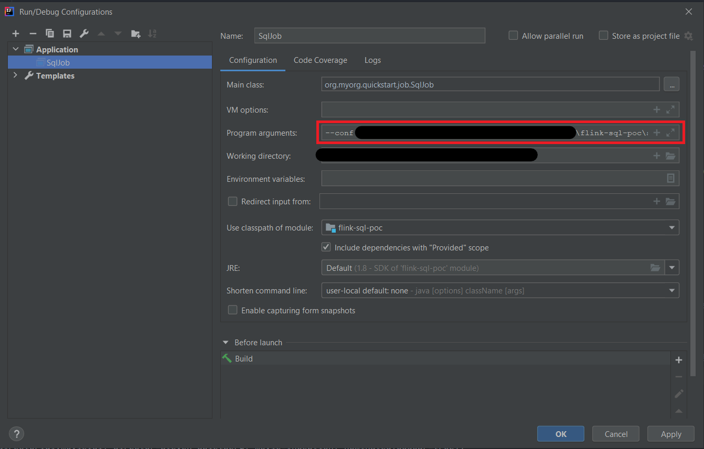

# Flink SQL POC

## Tests
The following commands work for Windows and Linux, but __in Windows they must be executed in Git Bash__ (or similar), using "unix paths ('/' instead of '\' and '/c/' instead of 'C:\')".

`tr -d '\r\n'` works for both, CRLF ('\r\n', Windows) and LF ('\n', Linux and MacOS).

The commands must be executed from the project root folder.

### Initial configuration
Before anything else, you must start:
1. Zookeper
2. Kafka

Set Kafka absolute path:
```bash
export KAFKA_ABSOLUTE_PATH="<kafka-absolute-path>"

# Example for Windows:
export KAFKA_ABSOLUTE_PATH="/c/Kafka/kafka_2.13-2.6.0"
```

For Windows:
```bash
export KAFKA_CONSOLE_PRODUCER="$KAFKA_ABSOLUTE_PATH/bin/windows/kafka-console-producer.bat"
export KAFKA_CONSOLE_CONSUMER="$KAFKA_ABSOLUTE_PATH/bin/windows/kafka-console-consumer.bat"
export KAFKA_TOPICS="$KAFKA_ABSOLUTE_PATH/bin/windows/kafka-topics.bat"
```

For Linux:
```bash
export KAFKA_CONSOLE_PRODUCER="$KAFKA_ABSOLUTE_PATH/bin/kafka-console-producer.sh"
export KAFKA_CONSOLE_CONSUMER="$KAFKA_ABSOLUTE_PATH/bin/kafka-console-consumer.sh"
export KAFKA_TOPICS="$KAFKA_ABSOLUTE_PATH/bin/kafka-topics.sh"
```

### Create Kafka topics
```bash
"$KAFKA_TOPICS" --create --zookeeper localhost:2181 --replication-factor 1 --partitions 1 --topic movies
"$KAFKA_TOPICS" --create --zookeeper localhost:2181 --replication-factor 1 --partitions 1 --topic directors
```

### Optionally, launch consumers over the movies and directors topics
These consumers are useful to check that the events are sent correctly to both topics.

They should be created in different terminal windows.

Movies consumer (terminal window 2):
```bash
"$KAFKA_CONSOLE_CONSUMER" --topic movies --bootstrap-server localhost:9092 --property print.key=true
``` 

Directors consumer (terminal window 3):
```bash
"$KAFKA_CONSOLE_CONSUMER" --topic directors --bootstrap-server localhost:9092 --property print.key=true
``` 

### Run the Flink Job in IntelliJ
Step 1:  


Step 2:  


Step 3:  


### Test 1 (update normal fields)
Here we test inserts and updates in normal fields (fields that are not used as FKs and are not used in the filters of the WHERE clause).

| Event num | Input event                    | Output events                                                                               |
|-----------|--------------------------------|---------------------------------------------------------------------------------------------|
| 1         | movie1-event1                  |                                                                                             |
| 2         | director1-event1               | d1e1-m1e1 (Christopher Nolan, Inception, true)                                              |
| 3         | movie2-event1                  | d1e1-m2e1 (Christopher Nolan, Tenet, true)                                                  |
| 4         | director2-event1               |                                                                                             |
| 5         | movie3-event1                  | d2e1-m3e1 (James Cameron, Avatar, true)                                                     |
| 6         | director1-event2 (update name) | d1e2-m1e1 (Steven Spielberg, Inception, true) ; d1e2-m2e1 (Steven Spielberg, Tenet, true)   |
| 7         | director2-event2 (update name) | d2e2-m3e1 (Martin Scorsese, Avatar, true)                                                   |
| 8         | director1-event3 (update name) | d1e3-m1e1 (Quentin Tarantino, Inception, true) ; d1e3-m2e1 (Quentin Tarantino, Tenet, true) |
| 9         | movie1-event2 (update name)    | d1e3-m1e2 (Quentin Tarantino, Star Wars: The Empire Strikes Back, true)                     |

Commands to insert the previous events in the specified order:
```bash
cat docs/events/movies/movie1/movie1-event1.json | tr -d '\r\n' | xargs -0 echo -n 'movieId1#' | "$KAFKA_CONSOLE_PRODUCER" --topic movies --broker-list localhost:9092 --property "parse.key=true" --property "key.separator=#"; echo "Inserted event 1"
cat docs/events/directors/director1/director1-event1.json | tr -d '\r\n' | xargs -0 echo -n 'directorId1#' | "$KAFKA_CONSOLE_PRODUCER" --topic directors --broker-list localhost:9092 --property "parse.key=true" --property "key.separator=#"; echo "Inserted event 2"
cat docs/events/movies/movie2/movie2-event1.json | tr -d '\r\n' | xargs -0 echo -n 'movieId2#' | "$KAFKA_CONSOLE_PRODUCER" --topic movies --broker-list localhost:9092 --property "parse.key=true" --property "key.separator=#"; echo "Inserted event 3"
cat docs/events/directors/director2/director2-event1.json | tr -d '\r\n' | xargs -0 echo -n 'directorId2#' | "$KAFKA_CONSOLE_PRODUCER" --topic directors --broker-list localhost:9092 --property "parse.key=true" --property "key.separator=#"; echo "Inserted event 4"
cat docs/events/movies/movie3/movie3-event1.json | tr -d '\r\n' | xargs -0 echo -n 'movieId3#' | "$KAFKA_CONSOLE_PRODUCER" --topic movies --broker-list localhost:9092 --property "parse.key=true" --property "key.separator=#"; echo "Inserted event 5"
cat docs/events/directors/director1/director1-event2-update-name.json | tr -d '\r\n' | xargs -0 echo -n 'directorId1#' | "$KAFKA_CONSOLE_PRODUCER" --topic directors --broker-list localhost:9092 --property "parse.key=true" --property "key.separator=#"; echo "Inserted event 6"
cat docs/events/directors/director2/director2-event2-update-name.json | tr -d '\r\n' | xargs -0 echo -n 'directorId2#' | "$KAFKA_CONSOLE_PRODUCER" --topic directors --broker-list localhost:9092 --property "parse.key=true" --property "key.separator=#"; echo "Inserted event 7"
cat docs/events/directors/director1/director1-event3-update-name.json | tr -d '\r\n' | xargs -0 echo -n 'directorId1#' | "$KAFKA_CONSOLE_PRODUCER" --topic directors --broker-list localhost:9092 --property "parse.key=true" --property "key.separator=#"; echo "Inserted event 8"
cat docs/events/movies/movie1/movie1-event2-update-name.json | tr -d '\r\n' | xargs -0 echo -n 'movieId1#' | "$KAFKA_CONSOLE_PRODUCER" --topic movies --broker-list localhost:9092 --property "parse.key=true" --property "key.separator=#"; echo "Inserted event 9"
```

### Test 2 (update field to don't pass the filters in the WHERE clause)
Here we test that an event that previously passed the filters in the WHERE clause, now doesn't pass those filters, due to a change in the fields of that event.  
As a consequence of that, Flink should generate an event that retracts that event, to remove it from the "final materialized view", because it no longer satisfies the SQL query.

| Event num | Input event                            | Output events                                     |
|-----------|----------------------------------------|---------------------------------------------------|
| 10        | movie3-event2 (nominatedToOscar=false) | retract d2e2-m3e1 (Martin Scorsese, Avatar, true) |
| 11        | director2-event3 (update name)         |                                                   |

Commands to insert the previous events in the specified order:
```bash
cat docs/events/movies/movie3/movie3-event2-update-nominated-to-oscar-to-false.json | tr -d '\r\n' | xargs -0 echo -n 'movieId3#' | "$KAFKA_CONSOLE_PRODUCER" --topic movies --broker-list localhost:9092 --property "parse.key=true" --property "key.separator=#"; echo "Inserted event 10"
cat docs/events/directors/director2/director2-event3-update-name.json | tr -d '\r\n' | xargs -0 echo -n 'directorId2#' | "$KAFKA_CONSOLE_PRODUCER" --topic directors --broker-list localhost:9092 --property "parse.key=true" --property "key.separator=#"; echo "Inserted event 11"
```

### Test 3 (update FK field)
Here we test that a change in the FK value of an event is reflected in the joins.  
Flink should remove from the join states the relationship between that event and it's previous FK, and also generate an event that retracts that relationship, to remove it from the "final materialized view", because it is no longer valid.

| Event num | Input event                      | Output events                                                                                 |
|-----------|----------------------------------|-----------------------------------------------------------------------------------------------|
| 12        | movie2-event2 (FK change D1->D2) | retract d1e3-m2e1 (Quentin Tarantino, Tenet, true) ; d2e3-m2e2 (Pedro Almodóvar, Tenet, true) |
| 13        | director2-event4 (update name)   | d2e4-m2e2 (Guillermo del Toro, Tenet, true)                                                   |
| 14        | director1-event4 (update name)   | d1e4-m1e2 (Tim Burton, Star Wars: The Empire Strikes Back, true)                              |

Commands to insert the previous events in the specified order:
```bash
cat docs/events/movies/movie2/movie2-event2-fk-change.json | tr -d '\r\n' | xargs -0 echo -n 'movieId2#' | "$KAFKA_CONSOLE_PRODUCER" --topic movies --broker-list localhost:9092 --property "parse.key=true" --property "key.separator=#"; echo "Inserted event 12"
cat docs/events/directors/director2/director2-event4-update-name.json | tr -d '\r\n' | xargs -0 echo -n 'directorId2#' | "$KAFKA_CONSOLE_PRODUCER" --topic directors --broker-list localhost:9092 --property "parse.key=true" --property "key.separator=#"; echo "Inserted event 13"
cat docs/events/directors/director1/director1-event4-update-name.json | tr -d '\r\n' | xargs -0 echo -n 'directorId1#' | "$KAFKA_CONSOLE_PRODUCER" --topic directors --broker-list localhost:9092 --property "parse.key=true" --property "key.separator=#"; echo "Inserted event 14"

```
