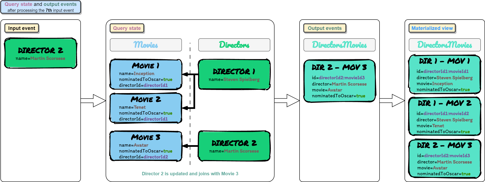
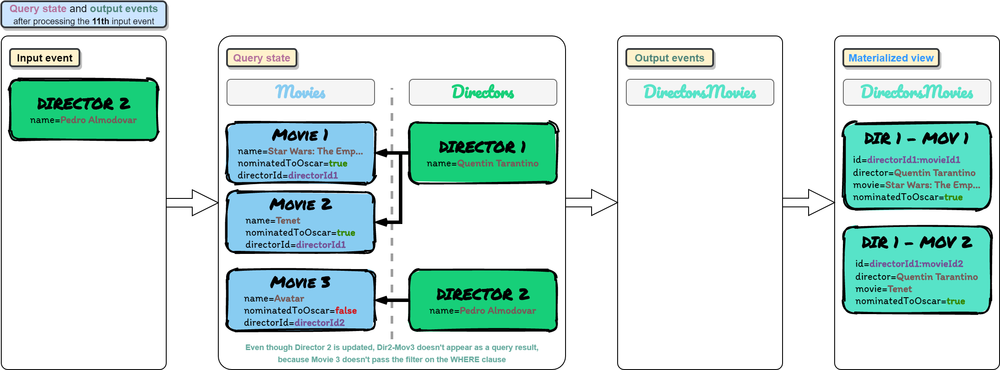
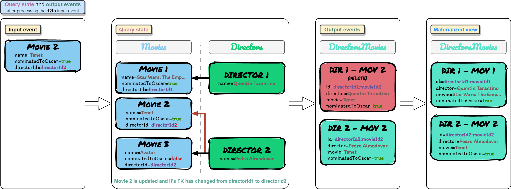
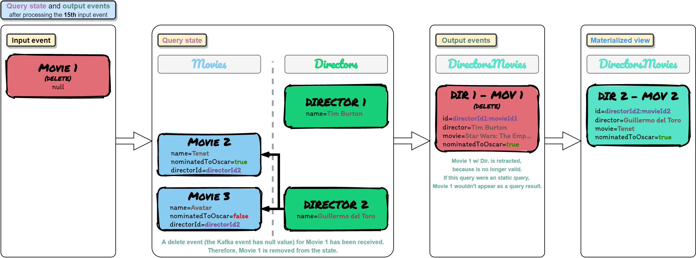

# Flink SQL POC

This project represents a Proof of Concept of Flink SQL capabilities.

It uses Vagrant to automate the creation of an Ubuntu VM that installs Docker,
pulls Zookeeper, Kafka and Kafkacat Docker images from DockerHub,
and runs containers for all of them with the corresponding port mappings for Kafka.


## Kafka
Kafka will be accessible:
* To the Docker containers inside the VM through `kafka:29092`
* To the VM and the host machine through `localhost:9092`
    * This is due to port mappings in the Kafka container and in the Vagrant VM

The following diagram shows the architecture:


### Kafka listeners
Rules:
* No listeners may share a port number.
* An advertised.listener must be present by protocol name and port number in the list of listeners.
* The script that configures the Docker image uses the listener name to determine whether to include the SSL configuration items. 
  If you want to use SSL, you need to include SSL in your listener name (e.g. OUTSIDE_SSL).
* Kafka brokers communicate between themselves, usually on the internal network (e.g. Docker network, AWS VPC, etc).
  To define which listener to use, specify KAFKA_INTER_BROKER_LISTENER_NAME (inter.broker.listener.name).
  The host/IP used must be accessible from the broker machine to others.

Kafka clients may well not be local to the broker’s network, and this is where the additional listeners come in.

When you run a client, the broker you pass to it is just where it’s going to go and get the metadata about brokers in the cluster from.
The actual host & IP that it will connect to for reading/writing data is based on the data that the broker passes back in that initial connection.

When connecting to a broker, the listener that will be returned to the client will be the listener to which you connected (based on the port).

With all this information, the following environment variables in the Kafka Docker image should be used to configure the listeners:
```yaml
kafka:
  environment:
    KAFKA_LISTENERS: INSIDE://kafka:29092,OUTSIDE://:9092
    KAFKA_ADVERTISED_LISTENERS: INSIDE://kafka:29092,OUTSIDE://localhost:9092
    KAFKA_LISTENER_SECURITY_PROTOCOL_MAP: INSIDE:PLAINTEXT,OUTSIDE:PLAINTEXT
    KAFKA_INTER_BROKER_LISTENER_NAME: INSIDE
```

The listener endpoint returned by Kafka can be tested with the following commands, executed inside the VM:
```bash
docker run --network=vagrant_default -it --rm edenhill/kafkacat:1.6.0 -b kafka:29092 -L

sudo apt-get install -y kafkacat
kafkacat -b localhost:9092 -L
```

> kafkacat is a useful tool for exploring this. Using -L you can see the metadata for the listener to which you connected. 

[More info about how Kafka listeners work](https://rmoff.net/2018/08/02/kafka-listeners-explained/)

### Kafka topics
The `docker-compose.yml` file automatically creates the following topics in the Kafka executed in the Docker container:
* __movies__:    1 partitions, 1 replicas
* __directors__: 1 partitions, 1 replicas
* __output__:    1 partitions, 1 replicas

This is specified in the `docker-compose.yml` file, in the following line:
```yaml
KAFKA_CREATE_TOPICS: "movies:1:1,directors:1:1,output:1:1"
```


## Entity relationship model
The following image shows the entity relationship model used in this demo:


## Prerequisites
* [Install VirtualBox](https://www.virtualbox.org/wiki/Downloads)
* [Install Vagrant](https://www.vagrantup.com/docs/installation)
* Install the `vagrant-docker-compose` Vagrant plugin:
  ```bash
  vagrant plugin install vagrant-docker-compose
  ```


## Steps to execute the POC
This section explains how to execute all the test cases implemented to test the Flink SQL capabilities.

### 1. Start the VM [host]
This will install Docker inside that VM, pull the docker images from DockerHub,
and run containers for Zookeeper and Kafka (Kafkacat will start and stop, it does not matter).

```bash
vagrant up
```

### 2. Connect to the VM [host]
This connection is done via ssh.

```bash
vagrant ssh
```

### 3. Set environment variables [vm]
```bash
export KAFKA_PRODUCER_MOVIES_PREFIX="docker run --network=vagrant_default -v /vagrant:/vagrant -it --rm edenhill/kafkacat:1.6.0 -b kafka:29092 -P -t movies -D '~' -K '|' -Z -l /vagrant/docs/events/movies/"
export KAFKA_PRODUCER_DIRECTORS_PREFIX="docker run --network=vagrant_default -v /vagrant:/vagrant -it --rm edenhill/kafkacat:1.6.0 -b kafka:29092 -P -t directors -D '~' -K '|' -Z -l /vagrant/docs/events/directors/"

```

### 4. Run the Flink Job in IntelliJ [host]
Step 1:  


Step 2:  


Step 3:  


Changes in the table stream will be printed in the IntelliJ `Run console`.

### 5. Test 1 (update normal fields) [vm]
Here we test inserts and updates in normal fields (fields that are not used as FKs and are not used in the filters of the WHERE clause).

| Event num | Input event                    | Output events                                                                               | Diagram                                                                              |
|-----------|--------------------------------|---------------------------------------------------------------------------------------------|--------------------------------------------------------------------------------------|
| 1         | movie1-event1                  |                                                                                             |  |
| 2         | director1-event1               | d1e1-m1e1 (Christopher Nolan, Inception, true)                                              |  |
| 3         | movie2-event1                  | d1e1-m2e1 (Christopher Nolan, Tenet, true)                                                  |  |
| 4         | director2-event1               |                                                                                             |  |
| 5         | movie3-event1                  | d2e1-m3e1 (James Cameron, Avatar, true)                                                     |  |
| 6         | director1-event2 (update name) | d1e2-m1e1 (Steven Spielberg, Inception, true) ; d1e2-m2e1 (Steven Spielberg, Tenet, true)   |  |
| 7         | director2-event2 (update name) | d2e2-m3e1 (Martin Scorsese, Avatar, true)                                                   |  |
| 8         | director1-event3 (update name) | d1e3-m1e1 (Quentin Tarantino, Inception, true) ; d1e3-m2e1 (Quentin Tarantino, Tenet, true) |  |
| 9         | movie1-event2 (update name)    | d1e3-m1e2 (Quentin Tarantino, Star Wars: The Empire Strikes Back, true)                     |  |

Commands that must be executed inside the VM created with Vagrant to insert the previous events in the specified order:
```bash
eval "$KAFKA_PRODUCER_MOVIES_PREFIX"movie1/movie1-event1.json; echo "Inserted event 1"
eval "$KAFKA_PRODUCER_DIRECTORS_PREFIX"director1/director1-event1.json; echo "Inserted event 2"
eval "$KAFKA_PRODUCER_MOVIES_PREFIX"movie2/movie2-event1.json; echo "Inserted event 3"
eval "$KAFKA_PRODUCER_DIRECTORS_PREFIX"director2/director2-event1.json; echo "Inserted event 4"
eval "$KAFKA_PRODUCER_MOVIES_PREFIX"movie3/movie3-event1.json; echo "Inserted event 5"
eval "$KAFKA_PRODUCER_DIRECTORS_PREFIX"director1/director1-event2-update-name.json; echo "Inserted event 6"
eval "$KAFKA_PRODUCER_DIRECTORS_PREFIX"director2/director2-event2-update-name.json; echo "Inserted event 7"
eval "$KAFKA_PRODUCER_DIRECTORS_PREFIX"director1/director1-event3-update-name.json; echo "Inserted event 8"
eval "$KAFKA_PRODUCER_MOVIES_PREFIX"movie1/movie1-event2-update-name.json; echo "Inserted event 9"

```

### Test 2 (update field to don't pass the filters in the WHERE clause)
Here we test that an event that previously passed the filters in the WHERE clause, now doesn't pass those filters, due to a change in the fields of that event.  
As a consequence of that, Flink should generate an event that retracts that event, to remove it from the "final materialized view", because it no longer satisfies the SQL query.

| Event num | Input event                            | Output events                                     | Diagram                                                                                |
|-----------|----------------------------------------|---------------------------------------------------|----------------------------------------------------------------------------------------|
| 10        | movie3-event2 (nominatedToOscar=false) | retract d2e2-m3e1 (Martin Scorsese, Avatar, true) |  |
| 11        | director2-event3 (update name)         |                                                   |  |

Commands to insert the previous events in the specified order:
```bash
eval "$KAFKA_PRODUCER_MOVIES_PREFIX"movie3/movie3-event2-update-nominated-to-oscar-to-false.json; echo "Inserted event 10"
eval "$KAFKA_PRODUCER_DIRECTORS_PREFIX"director2/director2-event3-update-name.json; echo "Inserted event 11"

```

### Test 3 (update FK field)
Here we test that a change in the FK value of an event is reflected in the joins.  
Flink should remove from the join states the relationship between that event and it's previous FK, and also generate an event that retracts that relationship, to remove it from the "final materialized view", because it is no longer valid.

| Event num | Input event                      | Output events                                                                                 | Diagram                                                                                |
|-----------|----------------------------------|-----------------------------------------------------------------------------------------------|----------------------------------------------------------------------------------------|
| 12        | movie2-event2 (FK change D1->D2) | retract d1e3-m2e1 (Quentin Tarantino, Tenet, true) ; d2e3-m2e2 (Pedro Almodóvar, Tenet, true) |  |
| 13        | director2-event4 (update name)   | d2e4-m2e2 (Guillermo del Toro, Tenet, true)                                                   |  |
| 14        | director1-event4 (update name)   | d1e4-m1e2 (Tim Burton, Star Wars: The Empire Strikes Back, true)                              |  |

Commands to insert the previous events in the specified order:
```bash
eval "$KAFKA_PRODUCER_MOVIES_PREFIX"movie2/movie2-event2-fk-change.json; echo "Inserted event 12"
eval "$KAFKA_PRODUCER_DIRECTORS_PREFIX"director2/director2-event4-update-name.json; echo "Inserted event 13"
eval "$KAFKA_PRODUCER_DIRECTORS_PREFIX"director1/director1-event4-update-name.json; echo "Inserted event 14"

```

### Test 4 (delete events)
Here we test delete events.  
An input Kafka event with a null value represents a “DELETE”.

| Event num | Input event                 | Output events                                                            | Diagram                                                                                |
|-----------|-----------------------------|--------------------------------------------------------------------------|----------------------------------------------------------------------------------------|
| 15        | movie1-event3 (delete)      | retract d1e4-m1e2 (Tim Burton, Star Wars: The Empire Strikes Back, true) |  |
| 16        | director2-event5 (delete)   | retract d2e4-m2e2 (Guillermo del Toro, Tenet, true)                      |  |
| 17        | movie2-event3 (update name) |                                                                          |  |

Commands to insert the previous events in the specified order:

```bash
eval "$KAFKA_PRODUCER_MOVIES_PREFIX"movie1/movie1-event3-delete.json; echo "Inserted event 15"
eval "$KAFKA_PRODUCER_DIRECTORS_PREFIX"director2/director2-event5-delete.json; echo "Inserted event 16"
eval "$KAFKA_PRODUCER_MOVIES_PREFIX"movie2/movie2-event3-update-name.json; echo "Inserted event 17"

```


## Other Kafkacat commands
### Producer reading events from stdin
```bash
docker run --network=vagrant_default -it --rm edenhill/kafkacat:1.6.0 -b kafka:9092 -P -t movies -K "|" -Z
```

### Producer reading events from file (located in the host)
```bash
docker run --network=vagrant_default -v /vagrant:/vagrant -it --rm edenhill/kafkacat:1.6.0 -b kafka:9092 -P -t movies -D "~" -K "|" -Z -l /vagrant/docs/events/movies/movie1/movie1-event1.json
```

### Consumer
```bash
docker run --network=vagrant_default -it --rm edenhill/kafkacat:1.6.0 -b kafka:9092 -C -t movies -f 'key: %k\nvalue: %s\n(offset: %o, key-bytes: %K, value-bytes: %S)\n\n\n'
```